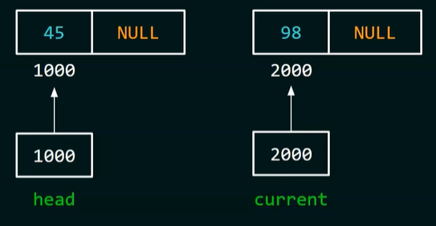

# Libft

This is a rewrite of various Libc functions from `<ctype.h>, <stdlib.h>, <string.h>`, as well as other general purpose functions.

String functions use `char`.

Binary functions use `unsigned char`. Ideal for representing raw binary data, as it corresponds directly to a byte. Useful for data that isn't inherently +ve or -ve, such as pixel values in images.

Integers use `int` or `size_t`, depending on usage.


## Data Types

`size_t` is unsigned int.

| Data Type | Bytes | Description                                                                |
| --------- | ----- | -------------------------------------------------------------------------- |
| char      | 1     | A single character                                                         |
| bool      | 1     | A boolean: true or false                                                   |
| short     | 2     | 1/2 size of integer: used to optimize memory                               |
| int       | 4     | An integer: used for loop counter                                          |
| long      | 8     | 2x size of integer, used when int overflow                                 |
| float     | 4     | A decimal (floating point) number: used for computer graphics              |
| double    | 8     | More precise version of float                                              |
| unsigned  | -     | Keyword for char, short, int, long: denotes it cannot have negative values |

## File Descriptor

When you use `write(2)` function, a file descriptor is used.

0 (stdin): reading user input from the terminal.

1 (stdout): writing to the terminal.

2 (stderr): writing errors to the terminal, can be redirected to a log file.

## Linked Lists

Node: A unit in a linked list containing data and a pointer to the next node.

Linked List: A series of nodes where each node points to the next.

Head: The first node in the linked list.

NULL: Indicates the end of the linked list.



## Libc Functions

- ft_isalpha
- ft_isdigit
- ft_isalnum
- ft_isascii
- ft_isprint
- ft_strlen
- ft_memset
- ft_bzero
- ft_memcpy
- ft_memmove
- ft_strlcpy
- ft_strlcat
- ft_toupper
- ft_tolower
- ft_strchr
- ft_strrchr
- ft_strncmp
- ft_memchr
- ft_memcmp
- ft_strnstr
- ft_atoi
- ft_calloc
- ft_strdup

### Docs

- https://youtu.be/Fc9htmvVZ9U
- https://youtu.be/XISnO2YhnsY
- https://www.geeksforgeeks.org/size_t-data-type-c-language/
- https://www.geeksforgeeks.org/c-typecasting/
- https://www.learncpp.com/cpp-tutorial/void-pointers/
- https://cs50.stackexchange.com/questions/14615/memory-overlap-in-c
- https://opensource.apple.com/source/Libc/Libc-997.1.1/string/strlcat.c.auto.html
- https://opensource.apple.com/source/xnu/xnu-4570.1.46/osfmk/arm/strlcpy.c.auto.html
- https://opensource.apple.com/source/Libc/Libc-1158.30.7/string/FreeBSD/strnstr.c.auto.html
- https://stackoverflow.com/questions/1296843/what-is-the-difference-between-null-0-and-0
- https://medium.com/a-42-journey/how-to-create-your-own-malloc-library-b86fedd39b96

## Additional Functions

- ft_substr
- ft_strjoin
- ft_strtrim
- ft_split
- ft_itoa
- ft_strmapi
- ft_striteri
- ft_putchar_fd
- ft_putstr_fd
- ft_putendl_fd
- ft_putnbr_fd

### Docs

- https://cplusplus.com/reference/cstring/strncpy/
- https://www.computerhope.com/jargon/f/file-descriptor.htm
- https://www.tutorialspoint.com/static-functions-in-c
- https://www.educative.io/answers/splitting-a-string-using-strtok-in-c
- https://users.cs.utah.edu/~germain/PPS/Topics/recursion.html

## Bonus Functions

- ft_lstnew
- ft_lstadd_front
- ft_lstsize
- ft_lstlast
- ft_lstadd_back
- ft_lstdelone
- ft_lstclear
- ft_lstiter
- ft_lstmap

### Docs

- https://youtu.be/E4lb2gkyXr8
- https://youtu.be/0euvEdPwQnQ?t=1833
- https://youtu.be/R9PTBwOzceo&list=PLBlnK6fEyqRj9lld8sWIUNwlKfdUoPd1Y&index=31

## Headers, Makefiles

- https://pulgamecanica.herokuapp.com/posts/makefiles
- https://github.com/Nuno-Jesus/Make-A-Make
- https://youtu.be/8KyZedtkEhk
- https://makefiletutorial.com/
- https://noahloomans.com/tutorials/makefile/

## Testers

- https://github.com/xicodomingues/francinette
- https://github.com/Tripouille/libftTester
- https://github.com/alelievr/libft-unit-test
- https://github.com/jtoty/Libftest

`francinette` or `paco`:

```
bash -c "$(curl -fsSL https://raw.github.com/xicodomingues/francinette/master/bin/install.sh)"

libft % paco calloc
```

`libftTester`:

Clone into libft.

```
sudo apt install valgrind
make m, b, a, calloc
```

`libft-unit-test`:

Clone as sibling.

```
sudo apt install libbsd-dev libncurses-dev
make f
```

```
so:
	$(CC) -nostartfiles -fPIC $(CFLAGS) $(SRC) $(SRCB)
	gcc -nostartfiles -shared -o libft.so $(OBJS) $(OBJSB)
.PHONY: so
```

`Libftest`:

Clone as sibling. Specify libft path in `my_config.sh`.

```
bash grademe.sh ft_calloc
```
